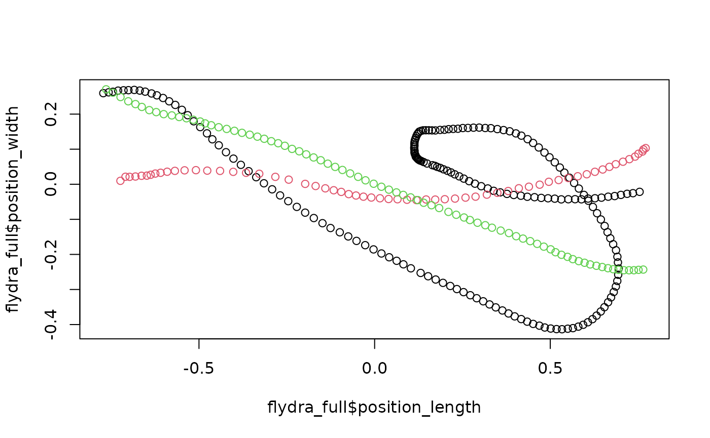
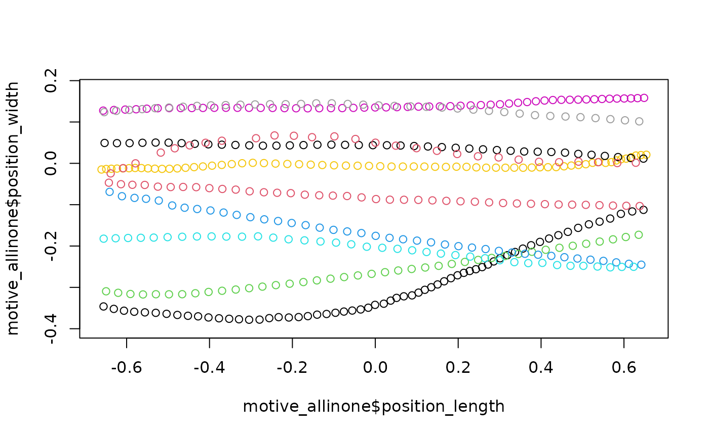

# Basics of data import and cleaning in pathviewr

## Overview

Raw movement data, including those from motion capture systems, may have
a variety of issues. These raw data often contain noise or artifacts
from the recording session, which may not be easily removed via the
recording software itself. Data may not be organized as “tidy” key-value
pairs (making plotting more difficult), the axes and overall orientation
of the environment may not conform to a standard, and individual
movement trajectories may be ill-defined.

`pathviewr` provides functions in R to deal with such problems (i.e.
“cleaning”). This vignette will cover the basics of how to import raw
data and how to clean data to prepare it for visualization and/or
statistical analyses.

## What do movement data sets look like?

At minimum, movement data provide information on a subject or object’s
position over time. These data are typically supplied in three
dimensions (e.g. x, y, z), with position in each dimension sampled at a
particular rate (e.g. 100 Hz). Different recording software may provide
additional features, such as the ability to track multiple subjects
simultaneously, information on subjects’ rotation, tracking of “rigid
body” elements, or even the ability to apply Kalman filters.

A central goal of `pathviewr` is to take data from different sources (so
far: Motive and Flydra), re-organize them into a common format that can
be wrangled in R, clean them up a bit, and get them ready for
visualization and/or statistical analyses. We’ll first cover what’s
included in Motive and in Flydra data and how `pathviewr` handles these.
Should you have data from another source, our
[`as_viewr()`](https://docs.ropensci.org/pathviewr/reference/as_viewr.md)
function will allow you to bring it into the `pathviewr` framework.

## Data import via `pathviewr`

Data can be imported via one of three functions:

- [`read_motive_csv()`](https://docs.ropensci.org/pathviewr/reference/read_motive_csv.md)
  imports data from `.csv` files that have been exported from
  Optitrack’s [Motive](https://optitrack.com/software/motive/) software

- [`read_flydra_mat()`](https://docs.ropensci.org/pathviewr/reference/read_flydra_mat.md)
  imports data from `.mat` files that have been exported from
  [Flydra](https://github.com/strawlab/flydra)

- [`as_viewr()`](https://docs.ropensci.org/pathviewr/reference/as_viewr.md)
  can be used to handle data from other sources

We will showcase examples from each of these methods in this section.

Please feel free to reach out to the `pathviewr` authors via [our Github
Issues page](https://github.com/ropensci/pathviewr/issues/) should you
have trouble with any of our data import options. We are happy to work
with you to design custom `read_` functions for file types we have not
encountered ourselves.

We’ll start by loading `pathviewr` and a few of the packages in the
`tidyverse`.

``` r

## If you do not already have pathviewr installed:
# install.packages("devtools")
# devtools::install_github("ropensci/pathviewr")

library(pathviewr)
library(ggplot2)
library(magrittr)
```

### Motive CSV files

`.csv` files exported from Motive can be imported via
[`read_motive_csv()`](https://docs.ropensci.org/pathviewr/reference/read_motive_csv.md)

``` r

## Import the Motive example data included in 
## the package

motive_data <-
  read_motive_csv(
    system.file("extdata", "pathviewr_motive_example_data.csv",
                package = 'pathviewr')
  )

## This produces a tibble 
motive_data
#> # A tibble: 934 × 26
#>    frame time_sec device02_rotation_x device02_rotation_y device02_rotation_z
#>    <int>    <dbl>               <dbl>               <dbl>               <dbl>
#>  1 72210     722.              0.135               -0.977             -0.112 
#>  2 72211     722.              0.0819              -0.978             -0.0991
#>  3 72212     722.              0.211               -0.973             -0.0939
#>  4 72213     722.              0.196               -0.972             -0.128 
#>  5 72214     722.              0.131               -0.975             -0.121 
#>  6 72215     722.              0.0935              -0.975             -0.105 
#>  7 72216     722.              0.180               -0.975             -0.106 
#>  8 72217     722.              0.164               -0.972             -0.149 
#>  9 72218     722.              0.120               -0.973             -0.149 
#> 10 72219     722.              0.155               -0.970             -0.120 
#> # ℹ 924 more rows
#> # ℹ 21 more variables: device02_rotation_w <dbl>, device02_position_x <dbl>,
#> #   device02_position_y <dbl>, device02_position_z <dbl>,
#> #   device02_mean_marker_error <dbl>, device03_rotation_x <dbl>,
#> #   device03_rotation_y <dbl>, device03_rotation_z <dbl>,
#> #   device03_rotation_w <dbl>, device03_position_x <dbl>,
#> #   device03_position_y <dbl>, device03_position_z <dbl>, …
```

A key thing to note is that these data, as stored in Motive CSVs, are
not “tidy”. Each frame occupies one row, but what that also means is
that the rotation and position values for the various subjects take up
24 columns! This format not only makes plotting data more difficult in
base R, `ggplot2`, and `rgl`, but also makes other aspects of data
wrangling more difficult. In a later step, we will ‘gather’ these data
into key-value pairs so that e.g. all length-wise position values are in
one column, all width-wise are in another…etc.

Metadata are stored as attributes. We won’t go through all of these, but
here are a couple important ones.

``` r

## E.g. to see the header of the original file:
attr(motive_data, "header")
#>                 metadata                      value
#> 1         Format Version                       1.23
#> 2              Take Name  sept-18_mixed-group_16-30
#> 3             Take Notes                           
#> 4     Capture Frame Rate                 100.000000
#> 5      Export Frame Rate                 100.000000
#> 6     Capture Start Time 2019-09-18 04.30.02.695 PM
#> 7   Total Frames in Take                     190951
#> 8  Total Exported Frames                     190951
#> 9          Rotation Type                 Quaternion
#> 10          Length Units                     Meters
#> 11      Coordinate Space                     Global

## Names of all marked objects:
attr(motive_data, "subject_names_simple")
#> [1] "device02" "device03" "device05"

## Types of data included
attr(motive_data, "data_types_simple")
#> [1] "Rigid Body"

## Frame rate
attr(motive_data, "frame_rate")
#> [1] 100
```

Storing such metatdata in the attributes is a key feature of
`pathviewr`. These metadata may not be as immediately as important as
the time series of position or rotation, but they can provide important
experimental information such as the date & time of capture and the
units of the position data (here, meters).

### Flydra Matlab files

`.mat` files exported from Flydra can be imported via
[`read_flydra_mat()`](https://docs.ropensci.org/pathviewr/reference/read_flydra_mat.md).

Note that you must supply a `subject_name` for Flydra data, as subject
names are not embedded in the `.mat` files. Only one name can be added
and it will be used throughout the resultant `tibble`.

``` r

## Import the Flydra example data included in 
## the package
flydra_data <-
  read_flydra_mat(
    system.file("extdata", 
                "pathviewr_flydra_example_data.mat",
                package = 'pathviewr'),
    subject_name = "birdie_wooster"
  )

## Similarly, this produces a tibble with important 
## metadata as attributes
flydra_data
#> # A tibble: 7,744 × 10
#>    frame time_sec subject        position_length position_width position_height
#>    <dbl>    <dbl> <chr>                    <dbl>          <dbl>           <dbl>
#>  1   746     0    birdie_wooster           0.869       -0.00417            1.31
#>  2   747     0.01 birdie_wooster           0.864       -0.00614            1.31
#>  3   748     0.02 birdie_wooster           0.863       -0.00695            1.31
#>  4   749     0.03 birdie_wooster           0.862       -0.00672            1.31
#>  5   750     0.04 birdie_wooster           0.862       -0.00644            1.31
#>  6   751     0.05 birdie_wooster           0.862       -0.00619            1.31
#>  7   752     0.06 birdie_wooster           0.863       -0.00667            1.31
#>  8   753     0.07 birdie_wooster           0.864       -0.00712            1.31
#>  9   754     0.08 birdie_wooster           0.865       -0.00727            1.31
#> 10   755     0.09 birdie_wooster           0.865       -0.00760            1.31
#> # ℹ 7,734 more rows
#> # ℹ 4 more variables: velocity <dbl>, length_inst_vel <dbl>,
#> #   width_inst_vel <dbl>, height_inst_vel <dbl>

attr(flydra_data, "frame_rate")
#> [1] 100
```

Note that unlike the example Motive data, the Flydra data are already
organized into key-value pairs. Because rotation is not captured by
Flydra, such data are also not included.

### Data from other sources

Data from another format can be converted to a `viewr` object via
[`pathviewr::as_viewr()`](https://docs.ropensci.org/pathviewr/reference/as_viewr.md).
Although this function does not handle data import per se, it allows
data that you may already have imported into R as a `tibble` or
`data.frame` to then be reformatted for use with `pathviewr` functions.

We’ll run through a quick example with simulated data:

``` r

## Create a dummy data frame with simulated (nonsense) data
df <-
  data.frame(
    frame = seq(1, 100, by = 1),
    time_sec = seq(0, by = 0.01, length.out = 100),
    subject = "birdie_sanders",
    z = rnorm(100),
    x = rnorm(100),
    y = rnorm(100)
  )

## Use as_viewr() to convert it into a viewr object
test <-
  as_viewr(
    df,
    frame_rate = 100,
    frame_col = 1,
    time_col = 2,
    subject_col = 3,
    position_length_col = 5,
    position_width_col = 6,
    position_height_col = 4
  )

## Some metadata are stored as attributes
attr(test, "frame_rate")
#> [1] 100
```

We also welcome you to request custom data import functions, especially
if
[`as_viewr()`](https://docs.ropensci.org/pathviewr/reference/as_viewr.md)
does not fit your needs. We are interested in expanding our data import
functions to accommodate additional file types. Please feel free to
[file a request for additional import
functions](https://github.com/ropensci/pathviewr/issues/new/choose) via
our Github Issues page.

## Data cleaning

As noted above, raw data often suffer the following:  
- contain noise or artifacts from the recording session  
- not organized as “tidy” key-value pairs  
- axes and overall orientation of the environment may not conform to a
standard  
- individual movement trajectories may be ill-defined

Several functions to clean and wrangle data are available, and we have a
suggested pipeline for how these steps should be handled. The rest of
this vignette will cover these steps.

All of the steps in the suggested pipeline are also covered by two
all-in-one functions:
[`clean_viewr()`](https://docs.ropensci.org/pathviewr/reference/clean_viewr.md)
and
[`import_and_clean_viewr()`](https://docs.ropensci.org/pathviewr/reference/import_and_clean_viewr.md).
See the section at the very end of this vignette for details.

And speaking of pipes, all functions in `pathviewr` are pipe-friendly.
We will detail each step separately, but each of the subsequent steps
may be piped, e.g.
`data %>% relabel_viewr_axes() %>% gather_tunnel_data()` etc etc

### Relabeling axes, gathering data columns, and trimming outliers

Axis labels (x, y, z) may be applied in arbitrary ways by software. A
user might intuitively think the z axis represents height, but the
original software may label it as the y axis instead.

`relabel_viewr_axes` provides a means to relabel axes with
“tunnel_length”, “tunnel_width”, and “tunnel_height”. **These axis
labels will be expected by subsequent functions, so skipping this step
is ill-advised.**

Typically, axes from Motive data will need to be relabled, but axes in
data imported from Flydra will not.

``` r

motive_relabeled <-
  motive_data %>%
  relabel_viewr_axes(
    tunnel_length = "_z",
    tunnel_width = "_x",
    tunnel_height = "_y",
    real = "_w"
  )

names(motive_relabeled)
#>  [1] "frame"                      "time_sec"                  
#>  [3] "device02_rotation_width"    "device02_rotation_height"  
#>  [5] "device02_rotation_length"   "device02_rotation_real"    
#>  [7] "device02_position_width"    "device02_position_height"  
#>  [9] "device02_position_length"   "device02_mean_marker_error"
#> [11] "device03_rotation_width"    "device03_rotation_height"  
#> [13] "device03_rotation_length"   "device03_rotation_real"    
#> [15] "device03_position_width"    "device03_position_height"  
#> [17] "device03_position_length"   "device03_mean_marker_error"
#> [19] "device05_rotation_width"    "device05_rotation_height"  
#> [21] "device05_rotation_length"   "device05_rotation_real"    
#> [23] "device05_position_width"    "device05_position_height"  
#> [25] "device05_position_length"   "device05_mean_marker_error"
```

Akin to the behavior of `dplyr::gather()`,
[`gather_tunnel_data()`](https://docs.ropensci.org/pathviewr/reference/gather_tunnel_data.md)
will take all data from a given session and organize it so that all data
of a given type are within one column, i.e. all position lengths are in
`position_length`, as opposed to separate length columns for each rigid
body. **These column names will be expected by subsequent functions, so
skipping this step is also ill-advised if you are using data from
Motive.** Should you have data from Flydra, this step should be
skipable.

Use
[`trim_tunnel_outliers()`](https://docs.ropensci.org/pathviewr/reference/trim_tunnel_outliers.md)
to remove extreme artifacts and other outlier data. What this function
does is create a (virtual) boundary box according to user-specification,
and any data outside that boundary are removed. For example, if you know
your arena measures 10m x 10m x 10m and your data were calibrated to
range from 0-10m in each dimension, you can be reasonably sure that
extreme values such as 45m on a given axis are bogus. This step is
entirely optional, and should only be used when the user is confident
that data outside certain ranges are artifacts or other bugs. Data
outside these ranges are then filtered out. Best to plot data beforehand
and check!!

``` r

## First gather and show the new column names
motive_gathered <-
  motive_relabeled %>%
  gather_tunnel_data()

names(motive_gathered)
#>  [1] "frame"             "time_sec"          "subject"          
#>  [4] "position_length"   "position_width"    "position_height"  
#>  [7] "rotation_length"   "rotation_width"    "rotation_height"  
#> [10] "rotation_real"     "mean_marker_error"

## Now trim, using ranges we know to safely include data
## and exclude artifacts. Anything outside these ranges 
## will be removed.
motive_trimmed <-
  motive_gathered %>%
  trim_tunnel_outliers(
    lengths_min = 0,
    lengths_max = 3,
    widths_min = -0.4,
    widths_max = 0.8,
    heights_min = -0.2,
    heights_max = 0.5
  )
```

### Standardization of tunnel position and coordinates

The coordinate system of the tunnel itself may require adjustment or
standardization. For example, data collected across different days may
show slight differences in coordinate systems if calibration equipment
was not used in identical ways. Moreover, the user may want to redefine
how the coordinate system itself is defined (i.e. change the location of
`(0, 0, 0)` to another place within the tunnel.

Note that having `(0, 0, 0)` set to the center of the region of interest
(covered in the next section of this vignette) is required for all
subsequent `pathviewr` functions to work.

`pathviewr` offers three main choices for such standardization:

- [`redefine_tunnel_center()`](https://docs.ropensci.org/pathviewr/reference/redefine_tunnel_center.md):
  Sets the location of 0 on any or all axes to a new location. See the
  Help page for this function to see the four different methods by which
  a user can specify this. No rotation of the tunnel is performed. This
  function can be used on both Motive and Flydra data.

- [`standardize_tunnel()`](https://docs.ropensci.org/pathviewr/reference/standardize_tunnel.md):
  Use specified landmarks (`subjects` within the `viewr` object) to
  rotate and translate the location of a tunnel, setting `(0, 0, 0)` to
  the center of the tunnel (centering). For example, in an avian flight
  tunnel, perches may be set up on opposite ends of the tunnel and rigid
  body markers may be set to them. The positions of these perches can be
  used as landmarks to standardize tunnel position. Note that this is
  typically not possible for Flydra data, since Flydra data will be
  imported with only one `subject`.

- `rotate_tunnel`: Rotate and center a tunnel based on user-defined
  coordinates (i.e. similar to
  [`standardize_tunnel()`](https://docs.ropensci.org/pathviewr/reference/standardize_tunnel.md)
  but for cases where specified landmarks are not in the data). This
  function can be used on both Motive and Flydra data.

Two quick examples will follow, using our Motive and Flydra data:

``` r

## Rotate and center the motive data set:
motive_rotated <-
  motive_trimmed %>% 
  rotate_tunnel(
    perch1_len_min = -0.06,
    perch1_len_max = 0.06,
    perch2_len_min = 2.48,
    perch2_len_max = 2.6,
    perch1_wid_min = 0.09,
    perch1_wid_max = 0.31,
    perch2_wid_min = 0.13,
    perch2_wid_max = 0.35
  )
```

In the above, virtual perches are defined by the user using the
arguments shown. The center of each perch is then found and then the
locations of the two perch centers are then used to 1) set `(0, 0, 0)`
to the point that is equidistant from the perches (i.e. the middle of
the tunnel) and 2) rotate the tunnel about the height axis so that both
perch width coordinates are at 0. This may be easier to understand
through plotting:

``` r

## Quick (base-R) plot of the original data
plot(motive_trimmed$position_length,
     motive_trimmed$position_width,
     asp = 1)
```


``` r


## Quick (base-R) plot of the rotated data
plot(motive_rotated$position_length,
     motive_rotated$position_width,
     asp = 1)
```


Differences due to rotation may be extremely subtle, but the redefining
of `(0, 0, 0)` to the middle of the tunnel should be clear from
contrasting the axes of the plots.

Flydra data typically do not need to be rotated, so we will instead use
[`redefine_tunnel_center()`](https://docs.ropensci.org/pathviewr/reference/redefine_tunnel_center.md)
to adjust the location of `(0, 0, 0)`:

``` r

## Re-center the Flydra data set:
flydra_centered <-
  flydra_data %>%
  redefine_tunnel_center(length_method = "middle",
                         height_method = "user-defined",
                         height_zero = 1.44)
```

Here, we are using `length_method = "middle"` to use the middle of the
range of “length” data to set length = 0 (a translation), making no
change to the width axis, and then specifying that height = 0 should be
equal to the value `1.44` from the original data (another translation).
Again, plotting may help; note that this time, we’ll plot length x
height (instead of width):

``` r

## Quick (base-R) plot of the original data
plot(flydra_data$position_length,
     flydra_data$position_height,
     asp = 1)
```


``` r


## Quick (base-R) plot of the redefined data
plot(flydra_centered$position_length,
     flydra_centered$position_height,
     asp = 1)
```


### Selecting a region of interest

This required step has benefits that are twofold: 1) treatment effects
on animal movement may only manifest over certain regions of the tunnel,
and 2) focusing on a subset of the data makes it easier to define
explicit trajectories and run computations faster.

The region of interest is defined via the function
[`select_x_percent()`](https://docs.ropensci.org/pathviewr/reference/select_x_percent.md).
Once tunnel coordinates have been standardized (via one of the function
in the previous section),
[`select_x_percent()`](https://docs.ropensci.org/pathviewr/reference/select_x_percent.md)
then selects the middle `x` percent (along the length axis) of the
tunnel as the region of interest. For example, selecting 50 percent
would start from the center of the tunnel and move 25% of the tunnel
along positive length and 25% along negative length values to then
select the middle 50% of the tunnel.

Quick examples:

``` r

## Motive data: select the middle 50% of the tunnel as the region of interest
motive_selected <-
  motive_rotated %>% select_x_percent(50)

## Quick plot:
plot(motive_selected$position_length,
     motive_selected$position_width,
     asp = 1)
```


``` r


## Flydra data:
flydra_selected <-
  flydra_centered %>% select_x_percent(50)

## Quick plot:
plot(flydra_selected$position_length,
     flydra_selected$position_width,
     asp = 1)
```


### Isolating each trajectory

The `pathviewr` standard for defining a trajectory is: continuous
movement from one side of the tunnel to the other over the span of the
region of interest. Note that this definition does not strictly require
linear movement from one end to the other; an animal could make several
loops inside the region of interest within a given trajectory.

Isolating trajectories is handled via the
[`separate_trajectories()`](https://docs.ropensci.org/pathviewr/reference/separate_trajectories.md)
function in `pathviewr`. Note that a region of interest must be selected
beforehand via
[`select_x_percent()`](https://docs.ropensci.org/pathviewr/reference/select_x_percent.md).

Because cameras may occasionally drop frames, we allow the user to
permit some relaxation of how stringent the “continuous movement”
criterion is. This is handled via the `max_frame_gap` argument within
[`separate_trajectories()`](https://docs.ropensci.org/pathviewr/reference/separate_trajectories.md).
For more details, please see [the vignette Managing frame gaps with
pathviewr](https://docs.ropensci.org/pathviewr/articles/managing-frame-gaps.html).

In our Motive example, we’ll use the automated feature built into the
function to guesstimate the best `max_frame_gap` allowed. When frame
gaps larger than `max_frame_gap` are encountered, the function will
force the defining of a new trajectory. But if frame gaps smaller than
`max_frame_gap` are encountered, keeping observations within the same
trajectory is permitted.

In the Flydra example, we’ll simply set `max_frame_gap` to `1` so that
no frame gaps are allowed (movement must be continuous with no dropped
frames).

``` r

motive_labeled <-
  motive_selected %>% 
  separate_trajectories(max_frame_gap = "autodetect")
#> autodetect is an experimental feature -- please report issues.

flydra_labeled <-
  flydra_selected %>% 
  separate_trajectories(max_frame_gap = 1)
```

### Retain only complete trajectories

Now that trajectories have been isolated and labeled, the final cleaning
step is to retain only the trajectories that completely span from one
end of the region of interest to the other.

This final step is handled via `pathviewr`’s
[`get_full_trajectories()`](https://docs.ropensci.org/pathviewr/reference/get_full_trajectories.md).

There is a built-in “fuzziness” feature: because trajectories may not
have observations exactly at the beginning or the end of the region of
interest, it may be necessary to allow trajectories to be slightly
shorter than the range of the selected region of interest. The `span`
parameter of this function handles this. By supplying a numeric
proportion from `0` to `1`, a user may allow trajectories to span that
proportion of the selected region. For example, setting `span = 0.95`
will keep all trajectories that span 95% of the length of the selected
region of interest. Setting `span = 1` (not recommended) will strictly
keep trajectories that start and end at the **exact** cut-offs of the
selected region of interest.

For these reasons, `span`s of `0.99` to `0.95` are generally
recommended. The best choice ultimately depends on your capture frame
rate as well as your own judgment. Should you desire to set it lower
(which you can), you may instead consider using a smaller region of
interest (i.e. set the `desired_percent` parameter in
[`select_x_percent()`](https://docs.ropensci.org/pathviewr/reference/select_x_percent.md)
to be lower).

``` r

## Motive
motive_full <-
  motive_labeled %>% 
  get_full_trajectories(span = 0.95)

plot(motive_full$position_length,
     motive_full$position_width,
     asp = 1, col = as.factor(motive_full$file_sub_traj))
```


``` r


## Flydra
flydra_full <-
  flydra_labeled %>% 
  get_full_trajectories(span = 0.95)

plot(flydra_full$position_length,
     flydra_full$position_width,
     asp = 1, col = as.factor(flydra_full$file_sub_traj))
```



### All-in-one cleaning functions

All of the above steps can also be done by using `pathviewr`’s
designated all-in-one functions.
[`import_and_clean_viewr()`](https://docs.ropensci.org/pathviewr/reference/import_and_clean_viewr.md)
imports raw data and allows the user to run through all of the cleaning
steps previously covered in this vignette.
[`clean_viewr()`](https://docs.ropensci.org/pathviewr/reference/clean_viewr.md)
does the same on any object already imported into the R environment
(i.e. it skips data import).

For both of these functions, all of the cleaning steps are set to `TRUE`
by default, but may be turned off by using `FALSE`. Argument names
correspond to standalone functions in `pathviewr`, and if the user wants
to use non-default values for corresponding arguments, they should also
be supplied for any steps that are set to `TRUE`.

For example, if the user keeps `select_x_percent = TRUE` as an argument
in
[`clean_viewr()`](https://docs.ropensci.org/pathviewr/reference/clean_viewr.md),
the
[`select_x_percent()`](https://docs.ropensci.org/pathviewr/reference/select_x_percent.md)
function is run internally. This means that should the user desire to
select a region of interest that does not match the default value of 33
percent, an additional argument should be supplied to
[`clean_viewr()`](https://docs.ropensci.org/pathviewr/reference/clean_viewr.md)
as if it were being supplied to
[`select_x_percent()`](https://docs.ropensci.org/pathviewr/reference/select_x_percent.md)
itself, e.g.: `desired_percent = 50`.

All additional arguments should be written out fully and explicitly.

Here’s an example using what we previously covered:

``` r

motive_allinone <-
  motive_data %>%
  clean_viewr(
    relabel_viewr_axes = TRUE,
    gather_tunnel_data = TRUE,
    trim_tunnel_outliers = TRUE,
    standardization_option = "rotate_tunnel",
    select_x_percent = TRUE,
    desired_percent = 50,
    rename_viewr_characters = FALSE,
    separate_trajectories = TRUE,
    max_frame_gap = "autodetect",
    get_full_trajectories = TRUE,
    span = 0.95
  )
#> autodetect is an experimental feature -- please report issues.

## Quick plot
plot(motive_allinone$position_length,
     motive_allinone$position_width,
     asp = 1, col = as.factor(motive_allinone$file_sub_traj))
```



That’s all!

🐢
